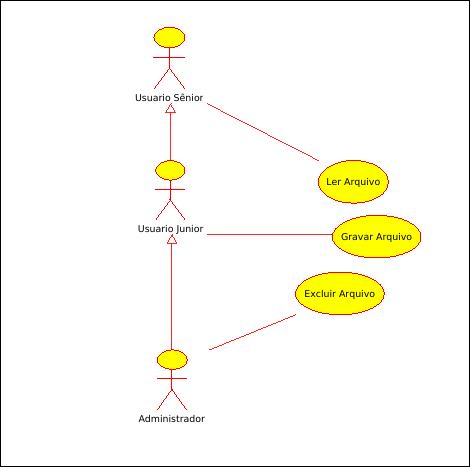

# Diagrama de Caso de Uso

O diagrama de caso de uso procura, por meio de uma linguagem simples, possibilitar a compreensão do comportamento externo do sistema (em termos de funcionalidades oferecidas por ele) por qualquer pessoa, tentando apresentar o sistema por intermédio de um usuário.

## Atores
O diagrama de caso de uso concentra-se em dois itens principais: atores e caso de uso. Os atores representam os papéis dos diversos usuários que poderão utilizar, de alguma maneira, os serviços e funções do sistema. Os atores são representados por um boneco de palitos.

## Casos de Uso
Os casos de uso são utilizados para __*capturar os requisitos do sistema, ou seja, referem-se aos serviços, tarefas ou funcionalidades identificados como necessários ao software*__ e que podem ser utilizados de alguma maneira pelos atores que interagem com o sistema.

Um caso de uso pode ser considerado **primario** ou **secundário**. Um caso de uso é considerado primário quando ser refere a um processo importante, que enfoca um dos requisitos funcionais do software, por exemplo, realizar um saque ou emitir um extrato em um sistema de controle bancário. Já um caso de uso secundário se refere a um processo perférico, como manutenção de um cadastro

Os casos de uso são representados por elipses contendo dentro de si um texto que descreve a que funcionalidade o caso de uso se refere.

### Exemplo

## Documentação de Casos de Uso
O objetivo principal da documentação de um caso de uso é fornecer um relatório ao cliente explicando qual o comportamente pretendido para um determinado caso de uso e quais funções ele executará quando for solicitado. Não existe um formato especifico definido pela UML para documentação de casos de uso, portanto, ele é bem flexível ao formato, podendo ser bem simples, ou complexo, caso o engenheiro prefira.

### Exemplo de Documentação
| Nome do caso de Uso             | Abrir conta                                                                                  |
|---------------------------------|----------------------------------------------------------------------------------------------|
| Caso de Uso Geral               |                                                                                              |
| Ator Principal                  | Cliente                                                                                      |
| Ator secundário                 | Funcionário                                                                                  |
| Resumo                          | Esse caso de uso descreve as etapas percorridas por um cliente para abrir uma conta corrente |
| Pré-condição                    | O pedido de abertura precisa ter sido previamente aprovado                                   |
| Pós-condição                    | É necessário realizar um deposito inicial                                                    |
| Fluxo Principal                 |                                                                                              |
| Ações do Ator                   | Ações do sistema                                                                             |
| 1 - Solicitar Abertura de conta |                                                                                              |
|                                 | 2 -Consultar cliente por seu CPF                                                             |
| 3 - Informar a senha da conta   |                                                                                              |
|                                 | 4 - Abrir a conta                                                                            |
| 5 - Fornecer Valor do depósito  |                                                                                              |
|                                 | 6 - Registrar o deposito e emtir cartão da conta.                                            |

## Associações
As associações apresentam interações ou relacionamento entre os atores que fazem parte do diagrama, entre os atores e os casos de uso ou os relacionamentos entre os casos de uso e outros casos de uso. O relacionamento entre os casos de uso, recebem outros nomes especiais, como inclusão, extensão e generalização.

Uma associação de um ator e um caso de uso, representa que esse ator utiliza de alguma forma a funcionalidade do sistema representada por aquele caso de uso em questão.

### Generalização/Especialização
A generalização/especialização acontece com atores ou casos de uso que herdam caracteristicas, isto é, tem caracteristicas muito semelhantes a outros casos de uso e atores. Como por exemplo o ator Pessoa, Pessoa Física e Pessoa Jurídica, sabemos que Pessoa Física e Jurídica tem todas as caracteristicas de Pessoa, portando é uma especialização do ator Pessoa, como por exemplo também o caso de uso Abrir conta comun, abrir conta especial e abrir conta poupança, para abrir qualuqer conta precisaremos das informações de abrir conta comun, então os outros casos de uso passam a ser uma especialização de abrir conta comun.

Na segunda imagem podemos ver claramente como funciona uma especialização, o usuário junior pode apenas ler arquivo, enquanto o usuario sênior pode gravar e ler arquivo, pois como é uma especialização do usuario junior ele herda todos os seus casos de uso, e o administrador pode fazer tudo que todos os outros usuarios podem fazer pois eh uma especialização do usuario junior.

# Inclusão
A associação de inclusão costuma ser utilizada quando existe um cenário, situação ou rotina comun a mais de um caso de uso. Quando isto ocorre, a documentação dessa rotina é colocada em um caso de uso especifico para que outros casos de uso utilizem esse serviço, evitando descrever uma mesma sequência de passos em vários casos de uso. É representado por uma linha tracejada com uma seta apontando para o caso de uso que será executado.

# Extensão
São utilizadas para descrever cenários opcionais de um caso de uso. Os casos de uso estendidos descrevem cenários em que não são obrigatoriamente utilizados, ou seja, só são utilizados se determinado acontecimento for satisfeito. Por exemplo quando vamos fazer login em algum sistema, quando não temos um login e tentamos efeturar, ele nos informa que a senha esta errada, e nos manda para uma pagina de registro.  

Na imagem acima o caso de uso autoregistrar há uma associação de extensão  com o caso de uso realizar login, isto significa que autoregistrar poderá ser chamado a partir de realizar login.

Uma boa prática é colocar uma nota explicativa em um relacionamento de extensão, com o texto entre chaves.
