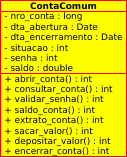
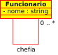
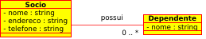
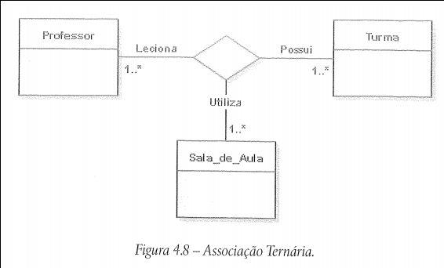
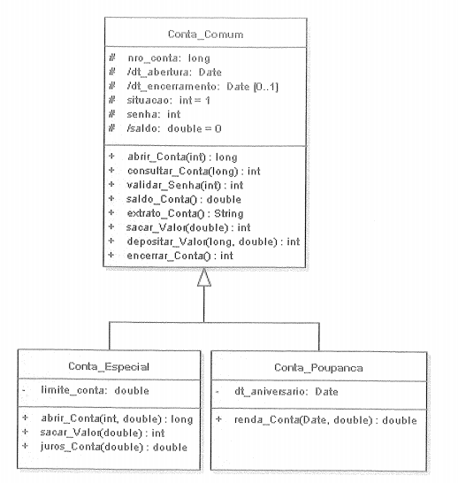

# Introdução

O diagrama de classe é um dos mais importantes e mais utilizados da UML. Seu principal objetivo é vizualizar as classes que comporão o sistema, bem como demostrar como elas se relacionam entre si. Basicamente o diagrama de classe é composto por suas classes e pelas associações (relações) existente entre elas.

Embora os métodos e os atibutos são todos colocados no diagrama de classe, o mesmo não trata o que cada um irá realizar, o que é trabalho de outro diagrama, o diagrama de atividade.

Uma classe é representada por um retangulo contendo três divisões:
A primeira divisão contém o nome da classe. A segunda armazena os atributos da classe. A terceira os métodos.

**Exemplo:**   

# Relacionamentos ou Associações
As classes constumam ter relacionamentos, entre si, chamados associações, que permitem que elas compartilhem informações entre sí e colaborem para a execução dos processos executados pelo sistema.

## Associação Unária ou reflexiva
Essa associação acontece quando um objeto da classe tem relação com objetos da mesma.

Neste exeplo temos uma linha saindo da classe Funcionario e chegando na própria classe, isto é porque um funcionario pode chefiar um funcionario, como pode ser visto no texto ao lado da linha, também podemos ver 0 .. \* isto é a **multiplicidade**. A multiplicidade procura determinar o numero minimo e maximo de objetos envolvidos em cada extremidade da associação, além de permitir especificar o nível de dependência de um objeto para com os outros envolvidos na associação. No caso apresentado, significa que 1 funcionarios pode chefiar 0 ou muitos (\*) funcionarios. Quando **não existe multiplicidade explícita entende-se que a multiplicidade é "1..1**"

## Associação Binária
Associações binárias acontecem quando são identificados relacionamentos entre objetos de duas classes distintas. Esse tipo de associação é, em geral, a mais comunmente encontrada.

Como podemos ver na imagem acima, uma instância da classe socio pode relacionar-se c om instâncias da classe Dependente, conforme demonstra a multiplicidade 0..\*, enquanto se existir um objeto da classe Dependente, este terá que se relacionar um um objeto a classe Socio, pois não foi definida multiplicidade na extremidade da classe Socio, isto siginifica qu esta é 1..1

# Associação Ternária ou N-ária
São associações que conectem objetos de mais de uma classe, são representados por um losango para onde convergem todas as ligações da associação. Veja na imagem abaixo

Podemos ler as associações na imagem acima como:
"Um professor leciona para no mínimo uma turma e no máximo para muitas, uma turma tem no mínimo um professor e no máximo muitos, e um professor ao lecionar para uma determinada turma, utiliza no mínimo uma sala e no máximo muitas"

# Agregação

É um tipo especial de associação onde se tenta demonstrar que as informações de um objeto(chamado objeto todo) precisam ser complementadas  pelas informações contidas em um ou mais objetos de outra classe(chamados objeto-parte). Em suma, É quando um objeto possui outros objetos, ele não depende desses objetos para existir.

Uma Gaveta pode conter Meias, mas a Gaveta não é feita de Meias. Ou seja, mesmo sem Meias a Gaveta ainda existirá.

# Composição
Uma associação do tipo composição constitui-se em uma variação da agregaçã, onde é apresentado um vínculo mais forte entre o objeto-todo e o objeto-parte, procurando demonstrar que os objetos-parte têm de estar associado a um único objeto-todo. Em suma, É quando um objeto é formado por outros objetos. Ou seja, suas partes o compõem, sem elas o objeto não existe  

# Generalização/Especialização
Como no diagrama de caso de uso, a generalização/especialização ocorre quando existe duas ou mais classes com características muito semelhantes. Assim, para evitar ter de declarar atributos e/ou métodos idênticos e como uma forma de reaproveitar código, cria-se uma classe geral em que são declarados os atributos comuns a todas as classes envolvidas no projeto.

